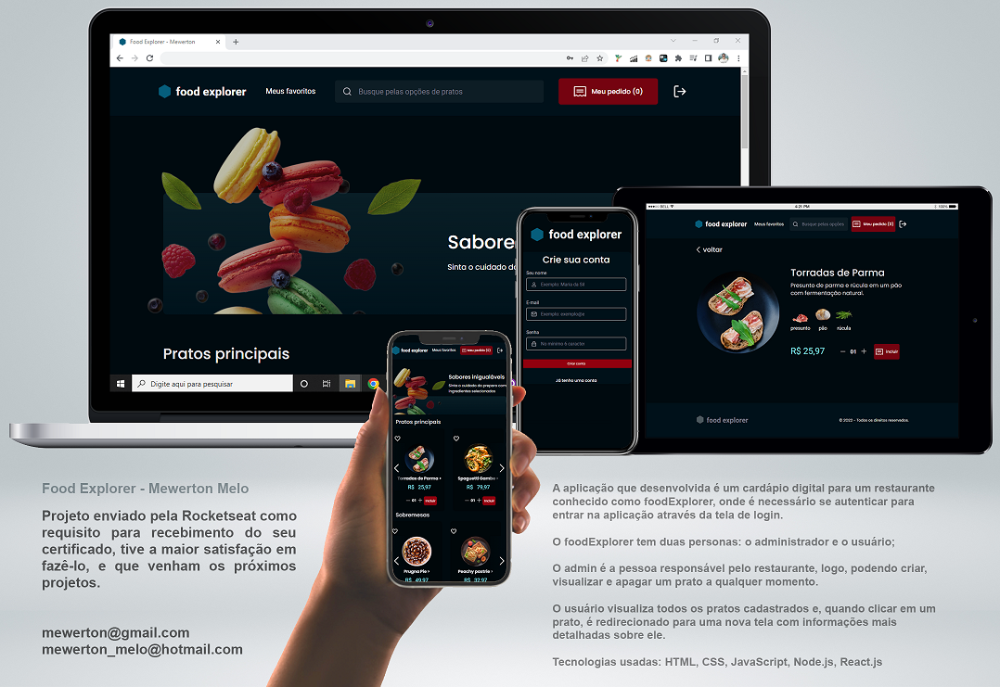

<p align="center">
  <h4 align="center"><a href="https://foodexpl0rer.netlify.app">FoodExplorer</a></h4>
</p>

<p align="center">
  
</p>

## 💻 Sobre:

O aplicativo desenvolvido é um cardápio digital para um restaurante conhecido como foodExplorer, onde é necessário se autenticar para entrar no aplicativo através da tela de login.

O Food Explorer tem duas pessoas: o administrador e o usuário;

O administrador é a pessoa responsável pelo restaurante, para que possa criar, visualizar e excluir um prato a qualquer momento. 

O usuário vê todos os pratos cadastrados e, ao clicar em um prato, é redirecionado para uma nova tela com informações mais detalhadas sobre ele.

Tanto o administrador quanto o usuário podem pesquisar pratos por nome.

Nesta aplicação, foram abordados os seguintes tópicos:

- [ReactJs](https://reactjs.org)
- [Node.js](https://nodejs.org/en/)
- [Javascript](https://developer.mozilla.org/pt-BR/docs/Web/JavaScript)
- [Vite](https://vitejs.dev/)
- [Express](https://expressjs.com)
- [Nodemon](https://nodemon.io/)
- [SQLite](https://www.sqlite.org/index.html)
- [Knex](https://knexjs.org/)
- [BCryptjs](https://www.npmjs.com/package/bcryptjs)
- [JSON Web Token](https://www.npmjs.com/package/jsonwebtoken)
- [Multer](https://www.npmjs.com/package/multer)
- [CORS](https://www.npmjs.com/package/cors)
- [Axios](https://www.npmjs.com/package/axios)
- [Styled Components](https://styled-components.com/)
- [React Icons](https://react-icons.github.io/react-icons/)
- [React Router Dom](https://react-icons.github.io/react-icons/)
---

## Características

- [x] Um projeto estruturado, com uma boa organização de pastas, divisão de componentes no front-end, etc.
- [x] Um arquivo README.md com as especificações sobre como executar o projeto em um ambiente de desenvolvimento.
- [x] Os usuários precisarão se autenticar para entrar no aplicativo por meio da tela de login.
- [x] O administrador fará o upload de imagens para registrar os pratos.
- [x] Nomes significativos para funções e variáveis: Trabalhando um pouco com conceitos de Código Limpo.
- [x] Os dados do administrador, do restaurante e do usuário serão armazenados em um banco de dados.
- [x] Possibilidade de pesquisar o nome do prato.
- [x] Sua interface consome minha própria API.
- [x] O aplicativo é responsivo: usando o conceito de Mobile First.
- [x] Atende ao modelo proposto no Figma e contém elementos indicativos de ação e estado.

---

## 🎨 Layout

O layout do site está disponível no Figma:

<a href="https://www.figma.com/file/GkqG5AUJe3ppcUEHfvOX6z/food-explorer?node-id=0%3A1">
  
</a>


## 🚀 Como executar o projeto.

Este projeto está dividido em duas partes:
1. Back-end (API) 
2. Front-end 

💡O back-end deve estar em execução em sua máquina para que o front-end seja reendereçado.

### Pré requisitos

Antes de começar, você precisará ter as seguintes ferramentas instaladas em sua máquina:
[Node.js] (https://nodejs.org/en/). 
Além disso, é bom ter um editor para trabalhar com o código, como [VSCode](https://code.visualstudio.com/)


### 🚧 Executando o BackEnd (servidor)

```bash
# Baixe do repositório
$ https://github.com/Gabrielingnau/FoodBackEnd

# Abra seu VS CODE e, em seguida, abra a pasta Backend para abrir o projeto
$ cd FoodExplorer_BackEnd

# No BackEnd, insira uma PORT e uma SECRET no arquivo .env vazio
  AUTH_SECRET=
  PORTA=

# Instale as dependências necessárias
$ npm install

# Agora inicie o servidor BackEnd
$ npm run dev

# O servidor iniciará na port: 3333 - vá para <http://localhost:3333>
```


### 💻 Executando o FrontEnd

```bash

# Baixe o repositório
$ https://github.com/mewerton/FoodExplorer_FrontEnd

# Abra seu VS CODE e, em seguida, abra a pasta Frontend para abrir o projeto
$FoodExplorer_FrontEnd

# Instale dependências com:
$ npm instal

# Execute o aplicativo no modo de desenvolvimento:
$ npm run dev

# O servidor iniciará na port: 3333 - vá para < http://127.0.0.1:5173/ >

# Admin Login
$ email: admin@gmail.com
$ password: 253647

```
---

## 🛠 Tecnologias

Este projeto foi desenvolvido com as seguintes tecnologias:

- HTML
-CSS
- JavaScript
- Node.js
- React.js

---

## Implante o projeto.
foodexpl0rer.netlify.app

___

Esse back-end foi hospedado diretamente no Render.
O Frontend, por outro lado, foi hospedado diretamente no Netlify.

___
Nota: Por estar hospedado em um serviço gratuito, o BackEnd "hiberna" após 15 minutos sem uso.
<br>
Se você estiver tentando acessar o site e o BackEnd não responder, aguarde pois ele estará "inicializando" os serviços.
<br>
Essa etapa pode levar até 1 minuto, dependendo da carga nos servidores de renderização.

---
⌨️ com ❤️ por [Gabriel Lingnau](https://www.linkedin.com/in/gabriel-lingnau-3bb17b266/) 😊
